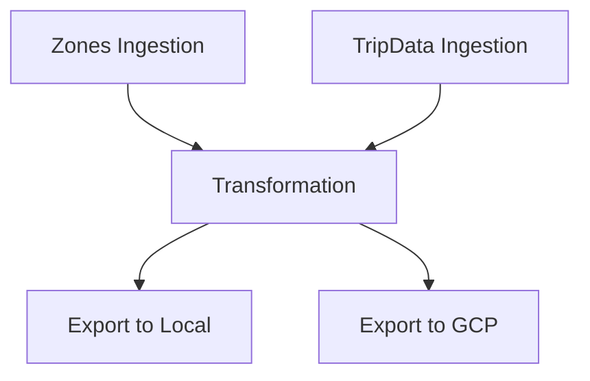

# 🚖 Uber Analytics Pipeline

[](https://www.python.org/)
[](https://spark.apache.org/)
[](https://www.terraform.io/)
[](https://cloud.google.com/)
[](LICENSE)

## 🔹 Project Overview

A **modular ETL pipeline** for processing Uber trip datasets, from raw ingestion to cloud storage, ready for analytics and machine learning.

### Data Flow




## 🛠 Technologies & Tools

- **Languages:** Python, SQL, Bash  
- **Big Data & ETL:** Apache Spark, PySpark, Data Lakes  
- **Cloud:** Google Cloud Platform (GCP)  
- **Infrastructure:** Terraform for automated bucket provisioning  
- **Version Control:** Git/GitHub  
- **Others:** Docker, Mage AI  

---

## 📦 Pipeline Overview

This project implements a **modular ETL pipeline** to process Uber trip datasets from raw ingestion to cloud storage, ready for analytics or machine learning tasks.

1. **Data Ingestion**  
   - Download and read large datasets from public Uber sources.  
   - Supports Parquet formats.  

2. **Data Transformation**  
   - Clean and normalize data.  
   - Calculate derived metrics like trip duration, pickup hour, and weekday.  
   - Filter relevant trips and join with geographic zone info.  

3. **Load / Export**  
   - Store the processed data in a **Google Cloud Storage bucket** using Mage AI.  
   - Fully automated, reproducible pipeline.

---

## ⚡ Key Features

- Modular architecture using **Mage AI** blocks.  
- Cloud infrastructure managed with **Terraform**.  
- Optimized transformations with **PySpark** for large-scale data.  
- ETL best practices: error handling, logging, and reproducible workflow.

---

## 📁 Project Structure

uber-analytics/<br>
├─ .file_versions/                   # Internal file versions (local version control)<br>
├─ .ssh_tunnel/                      # SSH tunnel configurations and scripts<br>
├─ data/                             # Main data<br>
├─ data_exporters/                   # Mage blocks to export data to other formats/systems<br>
├─ data_loaders/                     # Mage blocks to load data<br>
├─ pipelines/<br>
│  └─ uber_etl/                      # Pipeline folder for Uber-specific ETL processes in Mage<br>
├─ src/                              # Source code<br>
│  ├─ etl/                           # ETL functions (ingest, transform, load)<br>
│  └─ analysis/                      # Data analysis scripts and notebooks<br>
├─ terraform/                        # Terraform scripts (e.g., GCP bucket creation)<br>
├─ transformers/                     # Mage block to transform data<br>
├─ .gitignore                         # Files and folders ignored by Git<br>
├─ Pipfile                            # Dependencies managed with Pipenv<br>
├─ Pipfile.lock                       # Pipenv lockfile<br>
├─ README.md                           # Main project documentation<br>
├─ metadata.yaml                       # Project metadata<br>


---

## 🚀 How to Run

1. Set up your GCP credentials:
```bash
export GOOGLE_APPLICATION_CREDENTIALS="$(pwd)/terraform/keys/my-key.json"
```
2. Initialize Terraform and create the bucket:
```bash
cd terraform
terraform init
terraform apply
```
3. Start the Mage AI pipeline:
```bash
mage start
```


